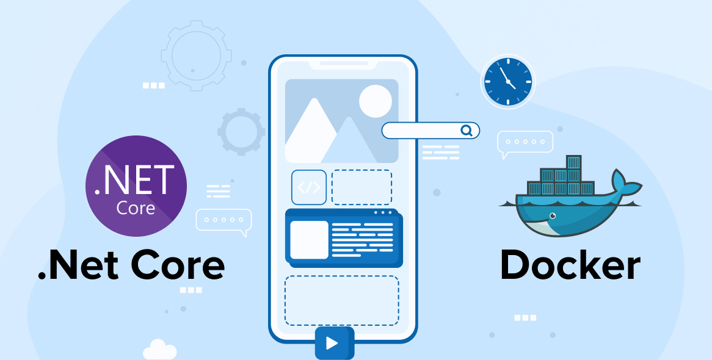

- [Desplegando nuestra aplicación](#desplegando-nuestra-aplicación)
  - [Ajustando perfiles de test](#ajustando-perfiles-de-test)
  - [Creando un archivo ejecutable](#creando-un-archivo-ejecutable)
  - [Despliegue de aplicación .NET en Docker](#despliegue-de-aplicación-net-en-docker)
  - [Compilando y Desplegar usando Docker](#compilando-y-desplegar-usando-docker)
  - [Usando Docker Compose](#usando-docker-compose)
- [Práctica de clase: Despliegue](#práctica-de-clase-despliegue)


# Desplegando nuestra aplicación

## Ajustando perfiles de test
En ASP.NET Core, los perfiles de configuración se manejan a través de los archivos `appsettings.json`. Puedes crear un archivo `appsettings.Development.json` para configuraciones específicas del entorno de desarrollo. Para establecer el entorno de ejecución, puedes configurar la variable de entorno `ASPNETCORE_ENVIRONMENT`.

```json
// appsettings.Development.json
{
  "Logging": {
    "LogLevel": {
      "Default": "Debug",
      "Microsoft": "Warning"
    }
  }
}
```

Para ejecutar la aplicación en el entorno `Development`, puedes establecer la variable de entorno antes de ejecutar la aplicación:

```bash
export ASPNETCORE_ENVIRONMENT=Development
dotnet run
```

## Creando un archivo ejecutable
Para crear un archivo ejecutable de tu aplicación, utiliza el comando `dotnet publish`:

```bash
dotnet publish -c Release
```

Esto generará un archivo ejecutable en el directorio `bin/Release/netX.X/publish`.

Para ejecutar el archivo, usa el siguiente comando:

```bash
dotnet bin/Release/netX.X/publish/TuAplicacion.dll
```

## Despliegue de aplicación .NET en Docker
Para desplegar una aplicación ASP.NET Core en un contenedor Docker, necesitarás un Dockerfile. Aquí te muestro un ejemplo básico:

```Dockerfile
# Usa una imagen base de .NET SDK para la compilación
FROM mcr.microsoft.com/dotnet/sdk:7.0 AS build
WORKDIR /app

# Copia los archivos .csproj y restaura las dependencias
COPY *.csproj ./
RUN dotnet restore

# Copia el resto de los archivos y construye la aplicación
COPY . .
RUN dotnet publish -c Release -o out

# Usa una imagen base de .NET Runtime para la ejecución
FROM mcr.microsoft.com/dotnet/aspnet:7.0 AS runtime
WORKDIR /app
COPY --from=build /app/out ./

# Expone el puerto 80
EXPOSE 80

# Define el comando para ejecutar la aplicación
ENTRYPOINT ["dotnet", "TuAplicacion.dll"]
```

Para construir la imagen de Docker:

```bash
docker build -t tu-aplicacion .
```

Y para ejecutar el contenedor:

```bash
docker run -p 80:80 tu-aplicacion
```

## Compilando y Desplegar usando Docker
Puedes utilizar un Dockerfile de múltiples etapas para compilar y desplegar tu aplicación:

```Dockerfile
# Etapa de compilación
FROM mcr.microsoft.com/dotnet/sdk:7.0 AS build
WORKDIR /source

# Copia los archivos .csproj y restaura las dependencias
COPY *.csproj .
RUN dotnet restore

# Copia el resto de los archivos y construye la aplicación
COPY . .
RUN dotnet publish -c Release -o /app/publish

# Etapa de ejecución
FROM mcr.microsoft.com/dotnet/aspnet:7.0 AS runtime
WORKDIR /app
COPY --from=build /app/publish .

# Expone el puerto 80
EXPOSE 80

# Define el comando para ejecutar la aplicación
ENTRYPOINT ["dotnet", "TuAplicacion.dll"]
```

Para construir y ejecutar la imagen:

```bash
docker build -t tu-aplicacion .
docker run -p 80:80 tu-aplicacion
```

## Usando Docker Compose
A continuación, se muestra un ejemplo básico de un archivo `docker-compose.yml` para gestionar tu aplicación:

```yaml
version: '3.8'
services:
  tu-aplicacion:
    build:
      context: .
      dockerfile: Dockerfile
    ports:
      - "80:80"
    restart: always
    environment:
      - ASPNETCORE_ENVIRONMENT=Production
```

Para construir y ejecutar tu aplicación con Docker Compose:

```bash
docker-compose up --build
```

Este comando construirá la imagen de tu aplicación y luego ejecutará el contenedor.


# Práctica de clase: Despliegue
1. Despliega completamente tu servicio usando docker, incluyendo las bases de datos necesarias para su funcionamiento. Ten en cuenta los perfiles dev y prod, para que puedas crear la imagen con uno y ejecutarla con otro.

